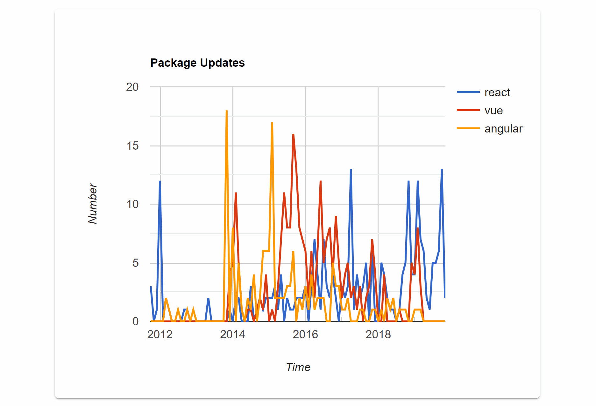
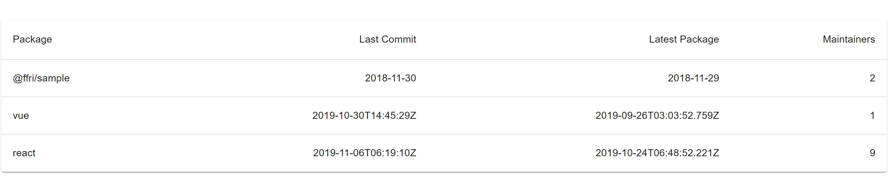
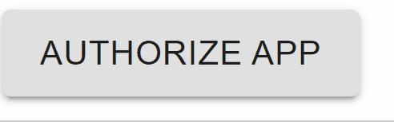

# NPM Devs Visualizer
Compare npm packages by their development momentum


## Why?
https://www.npmtrends.com/ is very useful to compare npm packages by their downloads.
However, we suppose that there exists another point of view that is also useful to package comparison, that is, development momentum.
You can compare packages by their time series of the number of open issues, open pull requests, commits and package updates.
We hope you find packages with great momentum by using the tool.

<strong>You will see wrong data for active packages.
See [Limitaion](#Limitation) for detail. </strong>

## Requirements
- Google Chrome Browser
- Python 3.6
- pipenv
- node v11+ (and npm)

That's all!

Alternatively, you can use Docker. See [Using Docker](#Using-Docker-Optional).

## Getting Started
### GitHub OAuth (Optional)
To use GitHub OAuth, you need to set the below environment variables.
```
export NPM_DEVS_VISUALIZER_CLIENT_ID=<your client_id of GitHub OAuth>
export NPM_DEVS_VISUALIZER_REDIRECT_URL=<your redirect_url of GitHub OAuth>
export NPM_DEVS_VISUALIZER_CLIENT_SECRET=<your client_secret of GitHub OAuth>
```
See https://developer.github.com/apps/building-oauth-apps/creating-an-oauth-app/.

For example, type `http://localhost:1234/` in "Homepage URL" and "Authorization callback URL" on the GitHub Settings page, type
```
export NPM_DEVS_VISUALIZER_REDIRECT_URL='http://localhost:1234/'
```
and set other environment variables.

If you change the environment variables, you need to remove build caches and to rebuild the app.

### Build
After `git clone`, you need to build the app to use.
- In the backend directory
```
pipenv shell
pipenv install
```
- In another terminal, go to the frontend directory and
```
npm install
npm run build
```
### Start
- In the backend directory
```
uvicorn main:app
```
- In the frontend directory
```
# You must set port_number to 1234 when you do not use NPM_DEVS_VISUALIZER_REDIRECT_URL variable.
npm run serve -- -p <port_number>
```

Now, you can access `localhost:1234` or `NPM_DEVS_VISUALIZER_REDIRECT_URL`. Cheers!

### Using Docker (Optional)
```
docker-compose up
```
Then go to `localhost:1234` or `NPM_DEVS_VISUALIZER_REDIRECT_URL` (whose port number must be 1234).

## How to use
### Searching

To search a package information, enter the package name in the search window and press the search icon (or press the enter key).

### Error Message

When something is wrong, you will see the corresponding error message badge.
You can delete the badge by clicking the cross mark of the badge. 

### Charts

When you search a package name, you will see the information of the package in the four charts. They will show the timelines of the number of open pull requests, open issues, commits and the updates of the package respectively.

You can zoom-in each chart by dragging the mouse across an area while pressing the left button and zoom-out by pressing the right button. 


### Table

- Package: Package Name
- Last Commit: Last Commit Date
- Latest Package: Date of the Latest Package registered
- Maintainers: Number of the Maintainers

### GitHub OAuth


## Limitation
- Only Latest Chrome Browser supported.
- 20 packages comparison per hour without Logging in GitHub.
  - This is due to the rate limit of GitHub API. You can use GitHub OAuth to avoid this limitation and to get more accurate data.
- <strong>Wrong data for active packages.</strong>
  - This is due to our implementation and the rate limit of GitHub API. We can obtain 100 entries at 1 GitHub API request, and we have not implemented the client to call the GitHub API endlessly, in order to avoid hitting the rate limit and hangs.
- The YYYY/MM/01 data shows the total number of {commits/package updates/open issues/open pulls} in YYYY/MM.
- The numbers of commits, open issues and open pull requests are those of the repository which the packages belong to. For instance, [gatsby-cli](https://www.npmjs.com/package/gatsby-cli) and [gatsby](https://www.npmjs.com/package/gatsby) show the same numbers.

## Development
### Run Tests
- In the backend directory
```
# You need to run "pipnev install --dev" to use pytest
pytest
```
- In the frontend directory
```
npm run test
```

## Author
Yuki Mogi. &copy; FFRI, Inc. 2019
